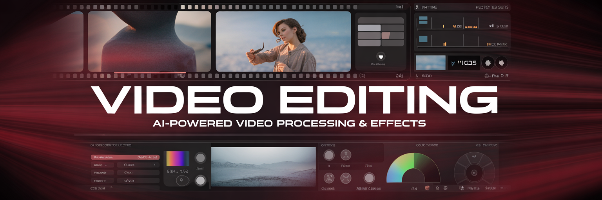

# generate-edit-video.js



Video editing, processing, and manipulation via Replicate. 10 models covering video modification, reframing, trimming, merging, extraction, upscaling, and captioning — all running on Replicate API.

## Quick Start

```bash
# AI video modification (default — Luma Modify)
node generate-edit-video.js "make it look cinematic" --video ./clip.mp4

# Reframe aspect ratio (Luma Reframe)
node generate-edit-video.js --model reframe --video ./clip.mp4 --aspect 9:16

# Trim video
node generate-edit-video.js --model trim --video ./clip.mp4 --start 5 --end 15

# Merge videos
node generate-edit-video.js --model merge --video ./clip1.mp4 --extra ./clip2.mp4

# Add audio to video
node generate-edit-video.js --model avmerge --video ./clip.mp4 --audio ./track.mp3

# Extract frames
node generate-edit-video.js --model frames --video ./clip.mp4 --format png

# Upscale video
node generate-edit-video.js --model upscale --video ./clip.mp4 --resolution 4k

# Add captions
node generate-edit-video.js --model caption --video ./clip.mp4
```

## CLI Options

| Option | Description | Default |
|--------|-------------|---------|
| `--model <name>` | Edit model to use | `modify` |
| `--video <path>` | Input video (**required** for all models) | — |
| `--audio <path>` | Audio file (for avmerge) | — |
| `--extra <path>` | Second video file (for merge) | — |
| `--aspect <ratio>` | Target aspect ratio (for reframe) | — |
| `--mode <str>` | Processing mode | — |
| `--start <n>` | Start time in seconds (for trim) | — |
| `--end <n>` | End time in seconds (for trim) | — |
| `--duration <n>` | Duration in seconds | — |
| `--resolution <str>` | Target resolution (720p, 1080p, 4k) | — |
| `--task <str>` | Processing task type | — |
| `--format <str>` | Output format (mp4, gif, png) | — |
| `--first-frame` | Extract first frame only | — |

## Models

| Key | Replicate ID | Name | Cost |
|-----|-------------|------|------|
| `modify` | `luma/modify-video` | Luma Modify | variable |
| `reframe` | `luma/reframe-video` | Luma Reframe | $0.06/sec |
| `trim` | `lucataco/trim-video` | Trim Video | <$0.001 |
| `merge` | `lucataco/video-merge` | Video Merge | variable |
| `avmerge` | local (ffmpeg-static) | Audio-Video Merge | free |
| `extract` | `lucataco/extract-audio` | Extract Audio | variable |
| `frames` | `lucataco/frame-extractor` | Frame Extractor | <$0.001 |
| `upscale` | `lucataco/real-esrgan-video` | Real-ESRGAN Video | ~$0.46 |
| `caption` | `fictions-ai/autocaption` | AutoCaption | ~$0.07 |
| `utils` | `nicolascoutureau/video-utils` | Video Utils | <$0.002 |

## Parameter Support Matrix

| Model | prompt | video | audio | extra | aspect | start/end | resolution | format | first-frame |
|-------|:------:|:-----:|:-----:|:-----:|:------:|:---------:|:----------:|:------:|:-----------:|
| `modify` | ✅ | ✅ req | — | — | — | — | — | — | ✅ |
| `reframe` | — | ✅ req | — | — | ✅ req | — | — | — | — |
| `trim` | — | ✅ req | — | — | — | ✅ req | ✅ | — | — |
| `merge` | — | ✅ req | — | ✅ req | — | — | — | — | — |
| `avmerge` | — | ✅ req | ✅ req | — | — | — | — | — | — |
| `extract` | — | ✅ req | — | — | — | — | — | ✅ | — |
| `frames` | — | ✅ req | — | — | — | ✅ | — | ✅ | — |
| `upscale` | — | ✅ req | — | — | — | — | ✅ | — | — |
| `caption` | — | ✅ req | — | — | — | — | — | — | — |
| `utils` | — | ✅ req | — | — | — | — | — | — | — |

## Model Categories

### AI Video Editing
- **modify** — Luma Modify: prompt-guided video editing and style transfer
- **reframe** — Luma Reframe: AI-powered crop/reframe to target aspect ratio

### Video Processing (Replicate)
- **trim** — Trim Video: extract segment by start/end times
- **merge** — Video Merge: concatenate video files
- **avmerge** — Audio-Video Merge: combine audio track with video (runs locally via ffmpeg-static, no Replicate call)
- **extract** — Extract Audio: strip audio from video file
- **frames** — Frame Extractor: export frames as images
- **utils** — Video Utils: miscellaneous video operations (convert, etc.)

### Enhancement
- **upscale** — Real-ESRGAN Video: AI-enhanced resolution upscaling
- **caption** — AutoCaption: automatic subtitle/caption generation

## Notes

- **All models require `--video`** — this is an editing script
- **All models run via Replicate API** (no local FFmpeg required)
- **modify** uses Luma Modify for AI-driven video transformation; pass `--first-frame` to process only the first frame
- **reframe** requires `--aspect` (e.g. `9:16`, `16:9`, `1:1`)
- **trim** requires `--start` and optionally `--end` or `--duration`
- **merge** requires `--extra` with the path to the second video
- **avmerge** requires `--audio` with the audio track to overlay; outputs stereo AAC 44100 Hz (ensures compatibility across all players including browsers)
- **avmerge runs locally** via `ffmpeg-static` — no Replicate API call, no cost, no network required
- Output saved to `./media/video/` with appropriate extension + JSON report
