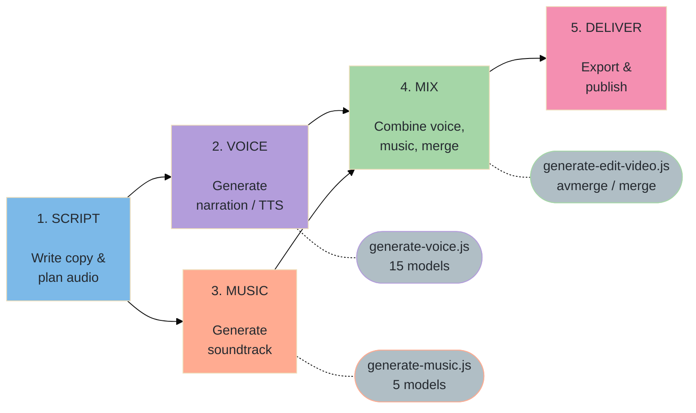
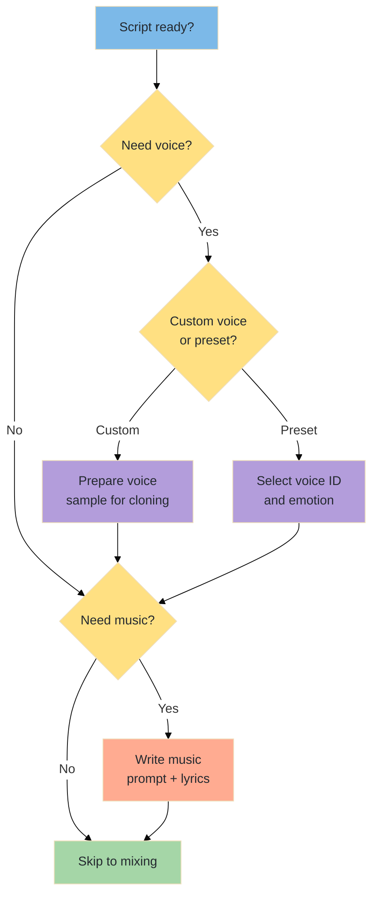
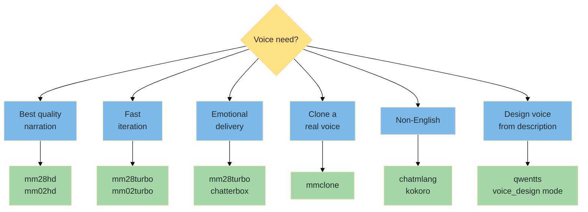
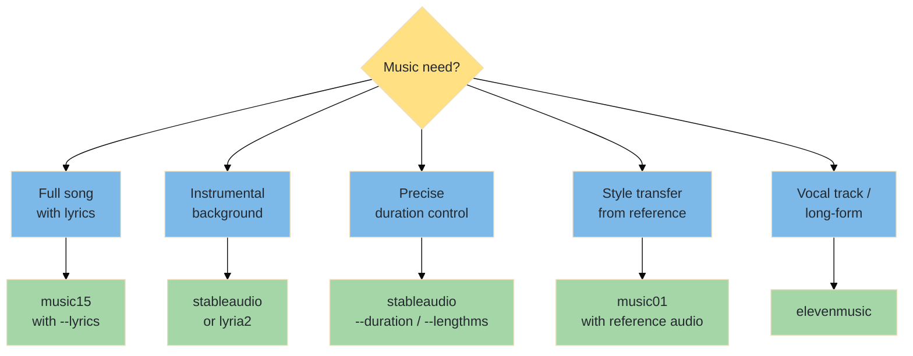
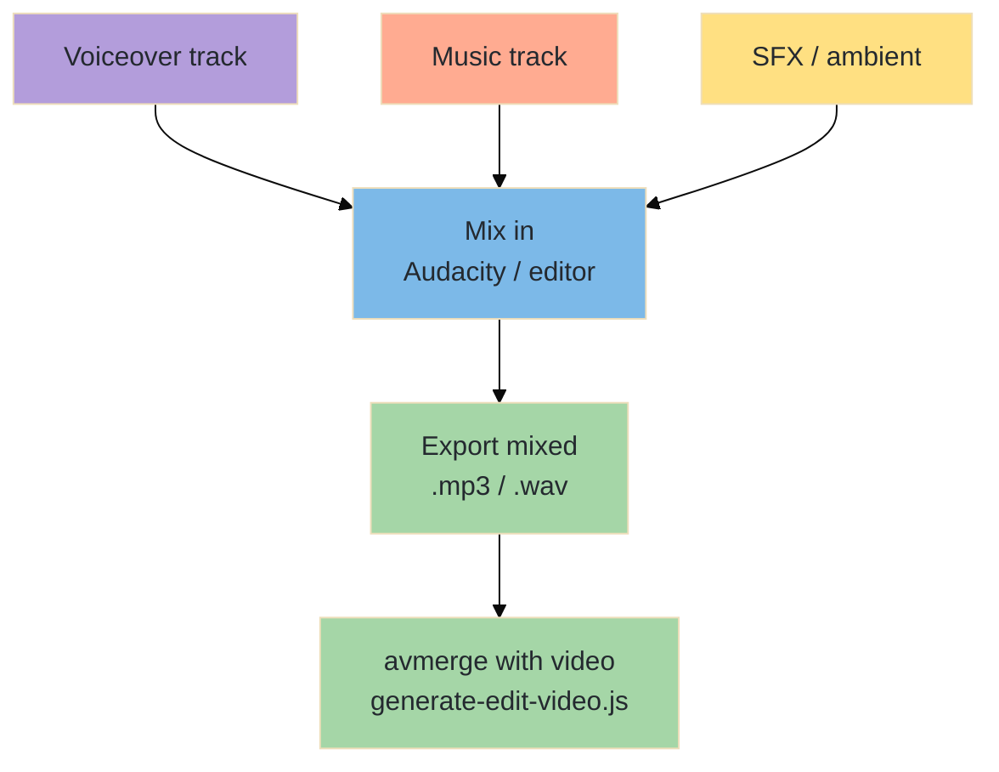

# From Script to Soundtrack — The Complete Audio Production Workflow

A step-by-step manual covering the full pipeline: script → voiceover → music → mix → deliver. Uses the AlexMedia CLI toolkit throughout.

---

## Table of Contents

1. [Workflow Overview](#workflow-overview)
2. [Phase 1 — Script & Planning](#phase-1--script--planning)
3. [Phase 2 — Voice Generation](#phase-2--voice-generation)
4. [Phase 3 — Music Generation](#phase-3--music-generation)
5. [Phase 4 — Mixing & Assembly](#phase-4--mixing--assembly)
6. [Phase 5 — Delivery](#phase-5--delivery)
7. [End-to-End Pipeline Examples](#end-to-end-pipeline-examples)
8. [Troubleshooting](#troubleshooting)
9. [Model Selection Guide](#model-selection-guide)

---

## Workflow Overview



---

## Phase 1 — Script & Planning

### 1a. Audio Project Types

| Type | Voice? | Music? | Duration | Example |
|------|--------|--------|----------|---------|
| **Podcast intro** | Yes | Yes | 15–30s | Branded jingle + host intro |
| **Explainer narration** | Yes | Optional | 30–120s | Product tour voiceover |
| **Music track** | Optional | Yes | 60–300s | Background music, full song |
| **Audiobook chapter** | Yes | No | 5–30 min | Long-form narration |
| **Social media audio** | Optional | Yes | 5–15s | Reel/TikTok soundtrack |
| **Voice clone** | Yes | No | Any | Custom voice for brand |

### 1b. Script Writing Tips

| Guideline | Why |
|-----------|-----|
| **Read aloud before generating** | What reads well doesn't always sound natural spoken |
| **Short sentences** | AI voice handles short sentences better; long ones lose cadence |
| **Add pauses** | Use periods and commas deliberately for natural breathing |
| **Include pronunciation hints** | "GIF (hard G)" or "read: AI as A.I." for clarity |
| **Time your script** | ~150 words per minute for natural pacing |
| **Segment for long content** | Break into 500-word chunks for consistent quality |

### 1c. Planning Checklist



---

## Phase 2 — Voice Generation

### 2a. Voice Model Decision Tree



### 2b. Standard Narration

```bash
# Best quality — MiniMax v2.8 HD
node scripts/generate-voice.js "Welcome to our product demo. Today we'll explore three features that will transform your workflow." --model mm28hd --voice English_Male_1

# Fast iteration — MiniMax v2.8 Turbo
node scripts/generate-voice.js "Welcome to our product demo." --model mm28turbo --voice English_Female_1

# Older but stable — MiniMax v0.2 HD
node scripts/generate-voice.js "This is a professional narration for a corporate video." --model mm02hd --voice English_Male_1
```

### 2c. Emotional & Expressive Voice

```bash
# Happy tone
node scripts/generate-voice.js "We're thrilled to announce our biggest update ever!" --model mm28turbo --emotion happy --speed 1.1

# Calm, serious tone
node scripts/generate-voice.js "In a world of constant change, stability is everything." --model mm28turbo --emotion calm --speed 0.9

# Dramatic delivery — Chatterbox
node scripts/generate-voice.js "The door creaked open. Something moved in the darkness." --model chatterbox

# High-energy — Chatterbox Pro
node scripts/generate-voice.js "ARE YOU READY? The sale of the century starts NOW!" --model chatpro
```

### 2d. Voice Cloning

```bash
# Step 1: Clone from a voice sample (10–30 seconds of clear speech)
node scripts/generate-voice.js --model mmclone --audio ./my-voice-sample.mp3

# Step 2: Use the returned voice_id in subsequent generations
# (voice_id is printed in the JSON report and can be reused)

# Note: Voice sample requirements:
# - 10–30 seconds of clear speech
# - Single speaker only
# - No background music or noise
# - High quality recording (no phone recordings)
```

### 2e. Multilingual & Design Voices

```bash
# French narration with reference audio
node scripts/generate-voice.js "Bienvenue dans notre démonstration de produit." --model chatmlang --audio ./french-ref.mp3

# Japanese narration — Kokoro (offline-capable)
node scripts/generate-voice.js "製品デモへようこそ。" --model kokoro --language ja

# Design a voice from a text description — Qwen 3 TTS
node scripts/generate-voice.js "Welcome to our showcase." --model qwentts
# Use voice_design mode in Qwen to describe: "Young female, warm, confident, slight British accent"

# ElevenLabs — premium quality
node scripts/generate-voice.js "This is a premium narration." --model elevenv3 --voice Rachel
```

### 2f. Voice Generation Best Practices

| Practice | Detail |
|----------|--------|
| **Test multiple voices** | Generate same line with 3–5 voices; pick the most natural |
| **Control speed for tone** | 0.8–0.9 for serious/dramatic; 1.0–1.1 for energetic |
| **Use HD for final, turbo for drafts** | HD models are 2–3x slower but noticeably better |
| **Keep lines under 500 characters** | Split long scripts into segments for consistent quality |
| **Match emotion to content** | "Happy" for positive; "calm" for professional; leave default for neutral |
| **Consistent voice across project** | Use the same voice ID and speed throughout a project |
| **Clean reference audio for cloning** | Background noise destroys clone quality |

---

## Phase 3 — Music Generation

### 3a. Music Model Decision Tree



### 3b. Background / Instrumental Music

```bash
# Cinematic ambient — precise duration
node scripts/generate-music.js "cinematic ambient soundtrack, hopeful, inspiring, no vocals, orchestral strings" --model stableaudio --duration 60

# Corporate / presentation background
node scripts/generate-music.js "modern corporate background music, upbeat, clean, no vocals" --model stableaudio --duration 120

# Chill lofi beats
node scripts/generate-music.js "lofi hip hop beats, relaxing, vinyl crackle, calm piano" --model music15

# Epic trailer music
node scripts/generate-music.js "epic cinematic trailer music, building tension, orchestral, drums" --model lyria2

# Short jingle (exact milliseconds)
node scripts/generate-music.js "happy corporate jingle, cheerful" --model stableaudio --lengthms 10000
```

### 3c. Songs with Lyrics

```bash
# Pop song structure
node scripts/generate-music.js "upbeat indie pop" --model music15 --lyrics "[verse]
Walking down the street
Sun is shining bright
[chorus]
We're alive tonight
Dancing in the light
[verse]
Coffee in my hand
Music fills the air
[chorus]
We're alive tonight
Dancing in the light"

# Rock ballad
node scripts/generate-music.js "acoustic rock ballad, emotional, guitar" --model music15 --lyrics "[intro]
[verse]
The road keeps going on
Through the rain and the dawn
[chorus]
I'll find my way back home
No more walking alone"
```

### 3d. Style Transfer & Reference

```bash
# Generate music in the style of a reference track
node scripts/generate-music.js "energetic electronic dance music" --model music01 --songfile ./reference-song.mp3

# Use separate vocal and instrumental references
node scripts/generate-music.js "pop ballad" --model music01 --voicefile ./vocal-ref.mp3 --instrfile ./instrumental-ref.mp3
```

### 3e. Music Generation Best Practices

| Practice | Detail |
|----------|--------|
| **Specify "no vocals" for background** | Without this, models may add singing |
| **Use `--duration` to match video** | Generate music matching your video length exactly |
| **Genre + mood + instruments** | Three elements for a solid prompt: "jazz, melancholic, saxophone" |
| **Lyrics use structure tags** | `[verse]`, `[chorus]`, `[bridge]`, `[intro]`, `[outro]` |
| **Keep lyrics simple** | AI music models handle simple, rhythmic lyrics best |
| **Generate multiple takes** | Same prompt produces different results; pick the best |
| **Style transfer needs clean reference** | Use high-quality reference audio, not phone recordings |

---

## Phase 4 — Mixing & Assembly

### 4a. Merge Audio with Video

```bash
# Add voiceover to a video
node scripts/generate-edit-video.js --model avmerge --video ./media/video.mp4 --audio ./media/voiceover.mp3

# Add music to a video
node scripts/generate-edit-video.js --model avmerge --video ./media/video.mp4 --audio ./media/music.mp3
```

### 4b. External Mixing (Recommended for Complex Projects)

For multi-track mixing (voice + music + SFX), use a free audio editor before final assembly:



### 4c. Mixing Guidelines

| Element | Volume Level | When |
|---------|-------------|------|
| **Voiceover** | 0 dB (reference) | Narration, dialogue |
| **Background music** | −12 to −18 dB | Under narration |
| **Music (no voice)** | −3 to −6 dB | Music-only sections |
| **Sound effects** | −6 to −9 dB | Accents, transitions |
| **Ambient / foley** | −18 to −24 dB | Subtle atmosphere |

### 4d. Recommended Free Audio Editors

| Tool | Platform | Best For |
|------|----------|----------|
| [Audacity](https://www.audacityteam.org/) | Win/Mac/Linux | Multi-track mixing, effects, EQ |
| [Ocenaudio](https://www.ocenaudio.com/) | Win/Mac/Linux | Quick edits, simple projects |
| [GarageBand](https://www.apple.com/garageband/) | Mac/iOS | Music mixing, loops, effects |

---

## Phase 5 — Delivery

### 5a. Audio Format Guide

| Format | Use Case | Quality | File Size |
|--------|----------|---------|-----------|
| **WAV** | Master / archive | Lossless | Large |
| **MP3 320kbps** | General distribution | Near-lossless | Medium |
| **MP3 128kbps** | Voice-only podcasts | Good | Small |
| **AAC** | Apple ecosystem, streaming | Good | Small |
| **OGG** | Open-source projects | Good | Small |
| **FLAC** | Lossless compressed | Lossless | Medium |

### 5b. Platform Requirements

| Platform | Format | Max Duration | Bitrate |
|----------|--------|-------------|---------|
| YouTube | MP4 (video) | 12 hours | 128–384 kbps |
| Spotify | WAV or FLAC | — | Lossless upload |
| Apple Music | WAV or FLAC | — | Lossless upload |
| Podcast (RSS) | MP3 | ~2 hours | 128 kbps mono |
| TikTok | MP4 (video) | 10 min | — |
| Social Stories | MP4 (video) | 15–90s | — |

---

## End-to-End Pipeline Examples

### Example 1 — Podcast Intro (20 seconds)

```bash
# 1. Generate background jingle
node scripts/generate-music.js "upbeat podcast intro jingle, modern, energetic, no vocals" --model stableaudio --duration 20

# 2. Generate host intro voiceover
node scripts/generate-voice.js "Welcome to The Tech Hour, your weekly deep dive into the world of technology. I'm your host, Alex." --model mm28hd --voice English_Male_1 --speed 1.05

# 3. Mix in Audacity (lower music volume, layer voice on top)
# Export as podcast-intro.mp3

# 4. Use in video if needed
node scripts/generate-edit-video.js --model avmerge --video ./media/video/intro-animation.mp4 --audio ./mixed/podcast-intro.mp3
```

### Example 2 — Explainer Video Narration

```bash
# 1. Write and generate narration segments
node scripts/generate-voice.js "Our platform helps teams collaborate in real time." --model mm28hd --voice English_Female_1 --speed 0.95
node scripts/generate-voice.js "With built-in analytics, you can track progress at a glance." --model mm28hd --voice English_Female_1 --speed 0.95
node scripts/generate-voice.js "Try it free for 30 days. No credit card required." --model mm28hd --voice English_Female_1 --speed 0.95

# 2. Generate background music (match total duration ~45s)
node scripts/generate-music.js "light corporate ambient, inspiring, clean, no vocals" --model stableaudio --duration 45

# 3. Mix voice segments + music in Audacity
# - Voice at 0 dB, Music at -15 dB
# - Export as explainer-audio.mp3

# 4. Merge with video
node scripts/generate-edit-video.js --model avmerge --video ./media/video/explainer-video.mp4 --audio ./mixed/explainer-audio.mp3
```

### Example 3 — Full Song Production

```bash
# 1. Write lyrics and generate the song
node scripts/generate-music.js "dreamy indie folk, acoustic guitar, female vocals" --model music15 --lyrics "[verse]
Fireflies in the jar
Memories from afar
[chorus]
Take me back to the start
Where you still had my heart
[bridge]
Time moves on but I stay
In the echoes of yesterday
[chorus]
Take me back to the start
Where you still had my heart"

# 2. Generate the same song 3 times — pick the best take
node scripts/generate-music.js "dreamy indie folk, acoustic guitar, female vocals" --model music15 --lyrics "..." --seed 100
node scripts/generate-music.js "dreamy indie folk, acoustic guitar, female vocals" --model music15 --lyrics "..." --seed 200
node scripts/generate-music.js "dreamy indie folk, acoustic guitar, female vocals" --model music15 --lyrics "..." --seed 300

# 3. Create a music video to accompany it (see video-production-workflow.md)
node scripts/generate-image.js "girl sitting on porch at twilight, fireflies, warm nostalgic, cinematic" --model nanapro
node scripts/generate-video.js "girl sitting on porch, fireflies floating around, warm golden light, gentle breeze" --model veo3 --image ./media/images/*porch*.png --duration 8
```

### Example 4 — Multilingual Product Audio

```bash
# 1. English version
node scripts/generate-voice.js "Welcome to our cutting-edge platform." --model mm28hd --voice English_Female_1

# 2. French version
node scripts/generate-voice.js "Bienvenue sur notre plateforme innovante." --model chatmlang --audio ./french-voice-ref.mp3

# 3. Japanese version
node scripts/generate-voice.js "革新的なプラットフォームへようこそ。" --model kokoro --language ja

# 4. Same background music for all
node scripts/generate-music.js "modern minimal corporate, no vocals" --model stableaudio --duration 15
```

---

## Troubleshooting

### Voice Issues

| Problem | Cause | Solution |
|---------|-------|----------|
| Voice sounds robotic | Model quality or speed too fast | Use `mm28hd` instead of turbo; try `--speed 0.9` |
| Pronunciation wrong | AI misreads word | Spell it phonetically: "GIF" → "jiff" or spell out "G-I-F" |
| Pauses in wrong places | Sentence structure | Add periods for longer pauses; commas for short pauses |
| Cloned voice doesn't match | Bad reference sample | Use 10–30s clean sample, single speaker, no noise |
| Emotion sounds forced | Wrong emotion for content | Try "calm" or remove emotion; not all content suits emotional delivery |
| Audio has background hum | Model artifact | Re-generate; try a different model |
| Long text cuts off | Model character limit | Split into 500-character chunks, generate separately |

### Music Issues

| Problem | Cause | Solution |
|---------|-------|----------|
| Music has unwanted vocals | Didn't specify instrumental | Add "no vocals, instrumental only" to prompt |
| Duration is wrong | Model ignored duration param | Use `stableaudio` with `--duration` for precise control |
| Style doesn't match prompt | Genre too specific or niche | Broaden genre; add instruments and mood as separate descriptors |
| Lyrics not sung properly | Complex or irregular lyrics | Simplify lyrics; use standard verse/chorus structure |
| Song structure is random | No structure tags | Use `[verse]`, `[chorus]`, `[bridge]` tags |
| Reference audio ignored | Quality too low | Use clean, high-quality reference; try different model |

### Mixing Issues

| Problem | Cause | Solution |
|---------|-------|----------|
| Voice drowned by music | Music too loud | Lower music to −12 to −18 dB below voice |
| Audio-video desync | Duration mismatch | Trim audio to match video length first |
| Pops and clicks at joins | Hard cuts between segments | Use crossfades in Audacity (0.1–0.3s overlap) |
| Stereo balance off | Model output characteristics | Pan to center in Audacity; export as mono for voice |

---

## Model Selection Guide

### Voice Models — Quick Reference

| Model | Quality | Speed | Emotion | Clone | Languages | Best For |
|-------|---------|-------|---------|-------|-----------|----------|
| `mm28turbo` | Good | Fast | Yes | No | EN | Quick drafts, emotional delivery |
| `mm28hd` | Best | Slow | Yes | No | EN | Final narration, production quality |
| `mm02turbo` | Good | Fast | Yes | No | EN | Stable, reliable TTS |
| `mm02hd` | Great | Slow | Yes | No | EN | Older but proven quality |
| `mm26turbo` | Good | Fast | Yes | No | EN | Budget production |
| `mm26hd` | Great | Slow | Yes | No | EN | Mid-tier quality |
| `mmclone` | Good | Med | No | Yes | EN | Voice cloning |
| `chatterbox` | Great | Med | Built-in | No | EN | Character voices, expressive |
| `chatturbo` | Good | Fast | Built-in | No | EN | Fast expressive voice |
| `chatpro` | Best | Slow | Built-in | No | EN | Premium expressive voice |
| `chatmlang` | Good | Med | No | Ref | Multi | Non-English narration |
| `qwentts` | Good | Med | No | Design | Multi | Voice design from text description |
| `elevenv3` | Best | Slow | No | No | Multi | ElevenLabs premium quality |
| `eleventurbo` | Good | Fast | No | No | Multi | ElevenLabs fast delivery |
| `kokoro` | Good | Fast | No | No | Multi | Offline-capable, multilingual |

### Music Models — Quick Reference

| Model | Best For | Lyrics? | Duration Control | Reference Audio |
|-------|----------|---------|-----------------|-----------------|
| `music15` (default) | Full songs, general purpose | Yes | Approximate | No |
| `music01` | Style transfer | No | No | Yes (song/voice/instr) |
| `stableaudio` | Instrumentals, precise timing | No | Exact (sec / ms) | No |
| `elevenmusic` | Vocal tracks, long-form | Optional | Approximate | No |
| `lyria2` | Google quality instrumental | No | Approximate | No |

---

*See also: [generate-voice.md](../scripts/generate-voice.md) · [generate-music.md](../scripts/generate-music.md) · [generate-edit-video.md](../scripts/generate-edit-video.md) · [video-production-workflow.md](video-production-workflow.md)*
