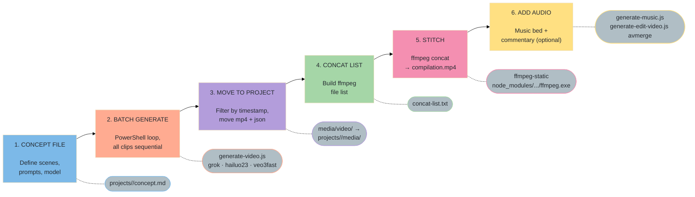
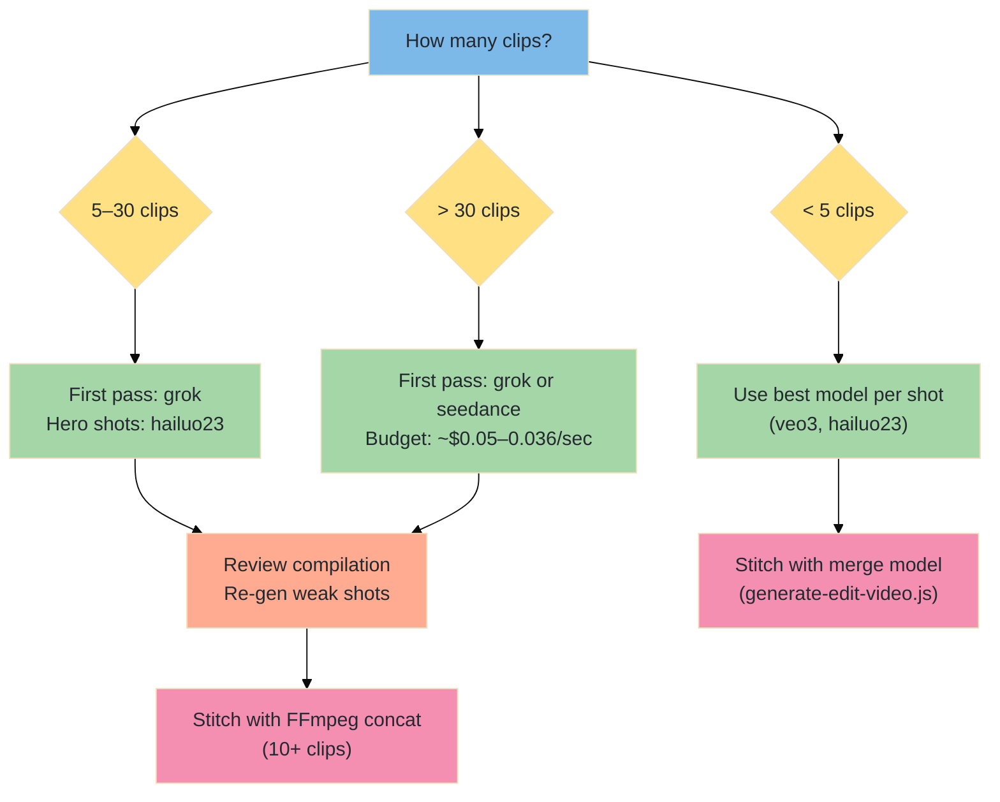

# Video Series & Compilation Workflow

A step-by-step guide for generating a thematic series of clips in bulk and stitching them into a single compiled video using the AlexMedia CLI toolkit.

**Proven on:** 26-clip gymnastics competition series → `gymnastics-compilation.mp4` (67MB, ~3.5 min)

---

## Table of Contents

1. [Workflow Overview](#workflow-overview)
2. [Phase 1 — Concept File](#phase-1--concept-file)
3. [Phase 2 — Batch Generation](#phase-2--batch-generation)
4. [Phase 3 — Move Files to Project](#phase-3--move-files-to-project)
5. [Phase 4 — Stitch Compilation](#phase-4--stitch-compilation)
6. [Phase 5 — Add Audio (Optional)](#phase-5--add-audio-optional)
7. [Model Selection for Series Work](#model-selection-for-series-work)
8. [Prompt Formulas by Genre](#prompt-formulas-by-genre)
9. [Troubleshooting](#troubleshooting)

---

## Workflow Overview



---

## Phase 1 — Concept File

Create a project folder and concept file before generating anything.

### Project Structure

```
projects/
  <series-name>/
    concept.md        ← scene list, prompts, model guide, prompt tips
    media/            ← clips land here after moving
      concat-list.txt ← generated during Phase 4
      compilation.mp4 ← final output
```

### Create the Project

```powershell
New-Item -ItemType Directory -Path "projects/<series-name>/media" -Force
```

### concept.md Structure

A good concept file contains:

| Section | Purpose |
|---------|---------|
| **Project header** | Name, design approach, target output |
| **Model selection table** | Goal → model → cost → why |
| **Scene sections** | Grouped by category, each with `node scripts/generate-video.js "..."` command |
| **Prompt Engineering Notes** | Table of reusable vocabulary for the genre |
| **Generation Order** | Which model to use when, cost guidance |

Example header:
```markdown
# Concept: Gymnastics Competition Videos

**Project:** AI-Generated Gymnastics Competition Clips
**Design Approach:** Broadcast-quality athletic motion
**Target:** A collection of cinematic competition clips
```

---

## Phase 2 — Batch Generation

### Model Choice for Series Work

| Model | Speed | Cost/clip (8s) | Audio | Best For |
|-------|-------|----------------|-------|----------|
| `grok` | ~39s | ~$0.40 | No | Rapid first-pass series — fastest iteration |
| `hailuo23` | ~136s | ~$0.40 | No | Human motion — use for hero shots or re-gens |
| `veo3fast` | ~90s | ~$1.20 | Yes | Broadcast quality + native crowd/ambient audio |
| `seedance` | ~60s | ~$0.29 | No | Cheapest iteration for prompt testing |

**Recommended:** use `grok` for the entire first-pass series. Re-generate specific hero shots with `hailuo23` or `veo3` once you've reviewed the compilation.

### PowerShell Batch Loop

```powershell
cd C:\Development\AlexVideos

$clips = @(
  @{ prompt = "YOUR FIRST SCENE DESCRIPTION HERE"; duration = 8 },
  @{ prompt = "YOUR SECOND SCENE DESCRIPTION HERE"; duration = 8 },
  @{ prompt = "YOUR THIRD SCENE DESCRIPTION HERE"; duration = 10 },
  # ... add all scenes
)

$total = $clips.Count
for ($i = 0; $i -lt $total; $i++) {
  $clip = $clips[$i]
  Write-Host "=== Clip $($i+1)/$total ===" -ForegroundColor Cyan
  node scripts/generate-video.js $clip.prompt --model grok --duration $clip.duration
}

Write-Host "All $total clips complete!" -ForegroundColor Green
```

**Important:** The script always writes output to `media/video/` at the repo root — not your current directory. Move files in Phase 3.

### Duration Guidelines

| Content Type | Recommended Duration |
|---|---|
| Single action / move | `6` |
| Action with setup + payoff | `8` (default) |
| Full routine / choreography | `10` |
| Maximum (grok) | `15` |

---

## Phase 3 — Move Files to Project

Generated clips land in `media/video/`. After a session, move them to the project folder.

### Filter by Session Timestamp

All clips from one generation run share the same date-hour prefix. Use that to isolate them:

```powershell
$src  = "C:\Development\AlexVideos\media\video"
$dest = "C:\Development\AlexVideos\projects\<series-name>\media"

# Replace "2026-03-05T04" with your session's timestamp prefix
Get-ChildItem $src | Where-Object { $_.Name -match "2026-03-05T04-" } |
  ForEach-Object { Move-Item $_.FullName $dest }
```

**Always move both `.mp4` AND `.json`** — the json is the generation metadata (prompt, model, cost, prediction ID).

### Find Your Timestamp Prefix

```powershell
# List recent files to identify your session's timestamp
Get-ChildItem media\video | Sort-Object LastWriteTime -Descending |
  Select-Object -First 10 Name
```

---

## Phase 4 — Stitch Compilation

For 10+ clips, use FFmpeg directly. It's bundled with the project at `node_modules\ffmpeg-static\ffmpeg.exe`.

> **Why not `generate-edit-video.js --model merge`?**
> The Replicate `lucataco/video-merge` model works well for 2–5 clips. For 10+ clips it becomes impractical — each call handles one join. FFmpeg handles 100 clips in a single pass in seconds.

### Step 1: Build the Concat List

Run from inside the project media folder:

```powershell
cd "C:\Development\AlexVideos\projects\<series-name>\media"

Get-ChildItem *.mp4 | Sort-Object Name |
  ForEach-Object { "file '$($_.FullName)'" } |
  Out-File concat-list.txt -Encoding UTF8
```

**Concat list format** — each line must be:
```
file 'C:\Full\Absolute\Path\To\Clip.mp4'
```
- Single quotes required around the path
- Absolute paths only (`-safe 0` flag allows this)
- Sorted by `Name` = sorted by timestamp = chronological generation order

Verify the list:
```powershell
Get-Content concat-list.txt | Select-Object -First 5
# Should show: file 'C:\Development\AlexVideos\projects\...\first-clip.mp4'
```

### Step 2: Run FFmpeg Concat

```powershell
$ffmpeg = "C:\Development\AlexVideos\node_modules\ffmpeg-static\ffmpeg.exe"

& $ffmpeg -f concat -safe 0 -i "concat-list.txt" `
  -c:v libx264 -preset fast -crf 22 `
  -c:a aac -b:a 192k `
  -movflags +faststart `
  "compilation.mp4" -y
```

**Flag reference:**

| Flag | Value | Purpose |
|------|-------|---------|
| `-f concat` | — | Use the concat demuxer |
| `-safe 0` | — | Allow absolute paths in the list |
| `-c:v libx264` | — | Re-encode video to consistent H.264 |
| `-preset fast` | — | Encode speed vs size tradeoff |
| `-crf 22` | 0–51 (lower=better) | Quality level — 22 is high quality |
| `-c:a aac` | — | Re-encode audio to AAC |
| `-b:a 192k` | — | Audio bitrate |
| `-movflags +faststart` | — | Move metadata to front for web streaming |
| `-y` | — | Overwrite output if it exists |

**Expected output:** 1–2 minutes for 26 clips on a modern machine. Final file size ≈ 2.5MB × number of clips.

### Step 3: Verify

```powershell
Get-Item compilation.mp4 | Select-Object Name, Length, LastWriteTime
# Should show file size and a recent timestamp
```

---

## Phase 5 — Add Audio (Optional)

### Option A: Background Music Bed

```powershell
cd C:\Development\AlexVideos

# Generate music matched to the mood and duration
node scripts/generate-music.js "epic sports compilation, orchestral swell, building energy, cinematic" --model music15 --duration 200

# Merge music under the compiled video
node scripts/generate-edit-video.js --op avmerge --video ./projects/<series>/media/compilation.mp4 --audio ./media/audio/<music-file>.mp3 --output ./projects/<series>/media/compilation-with-music.mp4
```

### Option B: Commentary Voice-Over

```powershell
# Generate narration
node scripts/generate-voice.js "Welcome to the gymnastics competition highlights reel..." --model elevenv3

# Merge voice over video
node scripts/generate-edit-video.js --op avmerge --video ./projects/<series>/media/compilation.mp4 --audio ./media/audio/<voice-file>.mp3 --output ./projects/<series>/media/compilation-voiced.mp4
```

> **Note:** `grok` clips have no audio track. `avmerge` adds one cleanly. Use `-c:a aac -ac 2 -ar 44100` (stereo AAC) if merging manually with FFmpeg — mono AAC can fail silently in some players.

---

## Model Selection for Series Work

### Full Decision Tree



### Cost Estimate for a 26-Clip Series

| Model | ~39s avg | Total time | Total cost |
|-------|----------|-----------|-----------|
| `grok` | 39s/clip | ~17 min | ~$10 |
| `hailuo23` | 136s/clip | ~60 min | ~$10 |
| `veo3fast` | 90s/clip | ~40 min | ~$31 (with audio) |
| `seedance` | 60s/clip | ~26 min | ~$7.50 |

---

## Prompt Formulas by Genre

### Sports / Athletics

```
[athlete description] [specific named move or technique] [body position cue] [landing/result] [venue] [camera angle] [speed technique]
```

Example:
> "A gymnast in a competition leotard executes a Pak salto from high bar to low bar, body in a tight hollow position, catches the low bar cleanly, swings through to a handstand pirouette, perfect vertical line at the top, chalk-lit arena, competition crowd visible, slow-motion"

**Vocabulary bank:**

| Element | Options |
|---------|---------|
| Camera | `broadcast angle`, `side-on slow-motion`, `broadcast close-up`, `aerial drone`, `tracking shot` |
| Speed | `slow-motion`, `ultra slow-motion`, `500fps`, `broadcast slow-motion` |
| Atmosphere | `crowd erupts`, `arena crowd reacts`, `audience applause`, `chalk dust settling` |
| Precision | `perfectly stuck landing`, `arms raised to judges`, `pointed toes`, `fully extended` |

### Dance / Performance

```
[performer in costume] [specific move/sequence] [transition cue] [stage/venue] [lighting mood] [camera movement]
```

### Nature / Wildlife

```
[animal species + age/size] [specific behavior] [environment detail] [weather/time of day] [camera style] [speed modifier]
```

### Architecture / Environment

```
[location type] [time of day / season] [atmospheric condition] [camera movement: dolly/pan/aerial] [unique visual detail] [mood]
```

---

## Troubleshooting

### FFmpeg concat produces a video with no audio

Clips from `grok`, `hailuo23`, `seedance` have no audio track. FFmpeg concat still works — the output will be silent. Add music/voice in Phase 5 using `avmerge`.

If you see this warning: `stream 0, timescale not set` — it's harmless. FFmpeg auto-inserts the `h264_mp4toannexb` bitstream filter and continues normally.

### Concat produces jumpy/stuttering playback

Clips were generated at different resolutions or frame rates. Add a re-encode filter:

```powershell
& $ffmpeg -f concat -safe 0 -i concat-list.txt `
  -vf "scale=1280:720:force_original_aspect_ratio=decrease,pad=1280:720:(ow-iw)/2:(oh-ih)/2" `
  -r 24 -c:v libx264 -preset fast -crf 22 `
  -c:a aac -b:a 192k -movflags +faststart `
  compilation-normalized.mp4 -y
```

### A clip is missing from the compilation

The concat list was built before all files were moved. Re-run the `Get-ChildItem | Out-File` step, then re-run FFmpeg.

### `generate-edit-video.js --model merge` fails with many clips

Expected — the Replicate `lucataco/video-merge` model accepts an array of video URLs but hits timeouts with 10+ clips. Switch to the direct FFmpeg method above.

### Terminal "loses" a long command

PowerShell wraps long lines and can misparse them. Break the command across lines with backtick continuation `` ` `` or use a script block `$cmd = "..."; Invoke-Expression $cmd`.

### Output file already exists error

Add `-y` flag to FFmpeg command to overwrite without prompting.

---

## Quick Reference Card

```powershell
# 1. Create project
New-Item -ItemType Directory -Path "projects/<name>/media" -Force

# 2. Generate clips (from repo root)
$clips = @(@{ prompt="..."; duration=8 }, ...)
for ($i=0; $i -lt $clips.Count; $i++) {
  node scripts/generate-video.js $clips[$i].prompt --model grok --duration $clips[$i].duration
}

# 3. Move clips
Get-ChildItem media\video | Where-Object { $_.Name -match "<TIMESTAMP-PREFIX>" } |
  ForEach-Object { Move-Item $_.FullName "projects\<name>\media" }

# 4. Build concat list (from inside media folder)
cd projects\<name>\media
Get-ChildItem *.mp4 | Sort-Object Name |
  ForEach-Object { "file '$($_.FullName)'" } |
  Out-File concat-list.txt -Encoding UTF8

# 5. Stitch
$ff = "C:\Development\AlexVideos\node_modules\ffmpeg-static\ffmpeg.exe"
& $ff -f concat -safe 0 -i concat-list.txt -c:v libx264 -preset fast -crf 22 -c:a aac -b:a 192k -movflags +faststart compilation.mp4 -y

# 6. Verify
Get-Item compilation.mp4 | Select-Object Name, @{n="MB";e={[math]::Round($_.Length/1MB,1)}}
```
